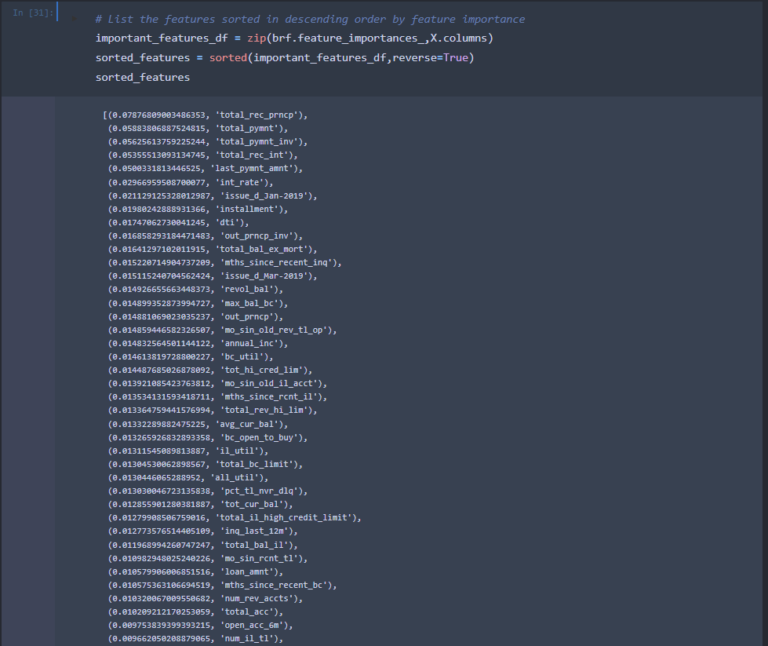

# Credit_Risk_Analysis

## Overview of the Project:

#### The goal of this project was to learn how to utilize several Machine Learning techniques in order to help Jill decide on a most effective Machine Learning Model to analyse Credit Card Risk applications and whether or not a person should be considered High Risk or Low Risk.

#### Credit risk is an inherently unbalanced classification problem, as good loans easily outnumber risky loans. In order to train and evaluate models with unbalanced classes, we used Imbalanced-learn and Scikit-learn Libraries to build and evaluate models using Resampling.

#### Using the credit card credit dataset from LendingClub, a peer-to-peer lending services company, we oversampled the data using the RandomOverSampler and SMOTE algorithms, and undersampled it using the ClusterCentroids algorithm. Then, we used a combinatorial approach of over and under sampling using the SMOTEENN algorithm. Lastly, we compared two other machine learning models that helped us confirm and reduce any bias in predicting credit risk, those models are BalancedRandomForestClassifier and EasyEnsembleClassifier.

## Results:

#### The models and algorithms considered and used are listed below:

    * Naive RandomOverSampler:
    * ClusterCentroids:
    * SMOTE:
    * SMOTEENN:
    * BalancedRandomForestClassifier:
    * EasyEnsembleClassifier:

#### Below are the results and evaluations completed per each model, in suppotive screenshots showing written scripts that got us the results.

* Naive RandomOverSampler Model:

* ClusterCentroids:

* SMOTE:

* SMOTEENN:

* BalancedRandomForestClassifier:

* EasyEnsembleClassifier:

#### While testing our models, and while working with the Balanced Random Forest Classifier, we organized each impactful feature and sorted them by their importance.

## Summary:

#### When going through the above results for each model used, we are able to notice how much more accuracy we got from our last two methods, the BalancedRandomForestClassifier and the EasyEnsembleClassifier models, our Balanced Accuracy was 93% and 79%, respectively. While for the initial methods, it didn't surpass 63%.

#### The EasyEnsembleClassifier Model also had a higher recall score of 92%. The other models were all way below that and around 70%. The high recall score for the high_risks indicates that a big percetange of potentially high risk loan seekers were declined by the system.

#### Within the same model, we also notice that Precision for High_risk was at 9%, which indicates that we have some False positive cases, which even though are not a high_risk they were detected as such by the model and would be prevented from approval.

#### Clearly the EasyEnsembleClassifier Model provided best results out of all the models tested in this analysis, and while we could recommend this method, the only challenge would be the amount of lost business due to high Precision for the high_risk category, and how many loan/credit application could be lost to a competitor due to the system rejecting/considering them a high_risk. 

#### Regardless of that, and from a safety standpoint, I would recommend the use of the EasyEnsembleClassifier model for predicting high risk loans.

     
