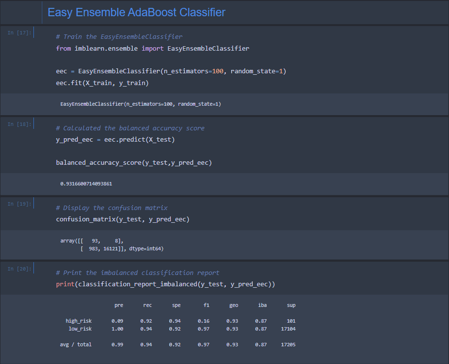

# Credit_Risk_Analysis

## Overview of the Project:

#### The goal of this project was to learn how to utilize several Machine Learning techniques in order to help Jill decide on a most effective Machine Learning Model to analyse Credit Card Risk applications and whether or not a person should be considered High Risk or Low Risk.

#### Credit risk is an inherently unbalanced classification problem, as good loans easily outnumber risky loans. In order to train and evaluate models with unbalanced classes, we used Imbalanced-learn and Scikit-learn Libraries to build and evaluate models using Resampling.

#### Using the credit card credit dataset from LendingClub, a peer-to-peer lending services company, we oversampled the data using the RandomOverSampler and SMOTE algorithms, and undersampled it using the ClusterCentroids algorithm. Then, we used a combinatorial approach of over and under sampling using the SMOTEENN algorithm. Lastly, we compared two other machine learning models that helped us confirm and reduce any bias in predicting credit risk, those models are BalancedRandomForestClassifier and EasyEnsembleClassifier.

## Results:

#### The models and algorithms considered and used are listed below:

    * Naive RandomOverSampler:
    * ClusterCentroids:
    * SMOTE:
    * SMOTEENN:
    * BalancedRandomForestClassifier:
    * EasyEnsembleClassifier:

#### Below are the results and evaluations completed per each model, in suppotive screenshots showing written scripts that got us the results.

* Naive RandomOverSampler Model:

* ClusterCentroids:

* SMOTE:

* SMOTEENN:

* BalancedRandomForestClassifier:

* EasyEnsembleClassifier:

#### While testing our models, and while working with the Balanced Random Forest Classifier, we created a two columns dataframe in which we organized each impactful feature and sorted them by their importance.

## Summary:

#### 

     
